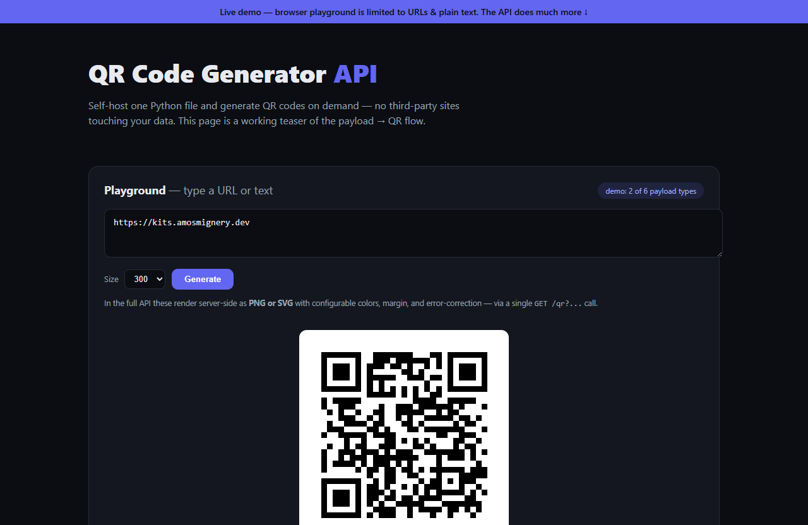

# QR Code Generator API — live demo

  

  <a href="https://amos-mig.github.io/qr-code-generator-api-demo/"><strong>▶ Open the live demo</strong></a> ·
  <a href="https://amosmign.gumroad.com/l/qr-code-generator-api"><strong>Get the full product · €29</strong></a>

## What this is

a live browser playground that generates real QR codes from any URL or text (capped at 300 chars), next to a sample of the API request format. vCard, WiFi, and SVG payload types are shown as locked cards.

**Try it:** Type any URL into the playground — it renders a scannable QR instantly.

## What you get in the full product

- Generate QR codes from URLs, text, vCards, and WiFi configs
- PNG and SVG output with configurable size and colors
- Error-correction levels and margins adjustable
- Self-hosted — your data stays yours
- One Python file, minimal dependencies

## About

- **Storefront:** [kits.amosmignery.dev](https://kits.amosmignery.dev) — single-file products, instant download, commercial license
- **Checkout:** [Gumroad](https://amosmign.gumroad.com/l/qr-code-generator-api) (Merchant of Record, VAT handled)
- **Full product:** [QR Code Generator API](https://amosmign.gumroad.com/l/qr-code-generator-api) · €29

## License

The demo page in this repo is MIT-licensed — reuse the technique, not the product.
The **QR Code Generator API** itself is not included here and is not free software.
